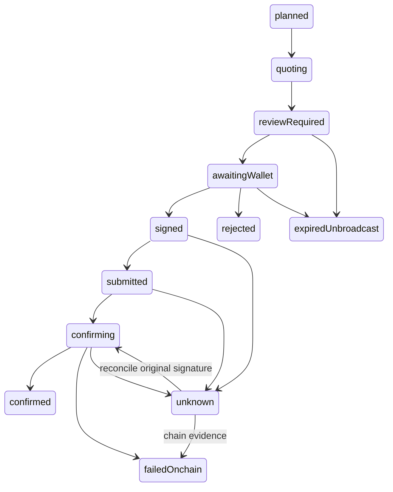

# Contribution implementation release — September 20, 2026

This record supersedes earlier implementation status in the same-day [planner release](release-20260920.md). Baseline: `c4e48e1`. The existing app, L1/L4/L5/L6 design, branch mark, exact arithmetic, auth, public-only PWA cache and original narrated films are preserved. The user authorized deployment. No funding, financial signature, transaction broadcast or competition submission occurred.

## What is now implemented

| Area | Implementation and evidence | Production boundary |
| --- | --- | --- |
| First visit | Visible search, explicitly applied illustrative three-asset starter, loading/error/empty/selected states; intentional empty drafts survive | Browser screenshots at 1440/768/390/320; live identity refresh still requires providers |
| Catalog | Official xStocks identities, initialized mainnet mint checks; 832 observed in current read-only probe | Membership is not liquidity, eligibility or a promise of a route |
| Units/holdings | Binary token-account decoding, all supported accounts aggregated, frozen amounts distinguished, mint+Clock observed together, official Scaled UI helper used once | Live public address had zero holdings; nonzero/multiple-account cases are deterministic tests |
| Quote errors | Typed no-route/halt/unsupported/rate-limit/stale/provider reasons survive HTTP 503; invalid/late responses cannot replace input | Keyless estimate contract verified; authenticated execution key remains absent |
| Semantic validator | `jupiter-route-v2-raydium-clmm-v1`; exact encoded input/minimum, bounded ALTs, programs/accounts, authority controls, network/fees, original-lifetime simulation | Actual unsigned mainnet order passed. Unknown routes and fee accounts remain unavailable |
| Approval/submission | Exact-message Wallet Standard signature; durable derived signature before provider call; old envelope-only attempts cannot resume into signing | Restricted launch remains disabled; no real settlement proof |
| Receipts/recovery | Confirmed exact-message receipt, preserved ALT resolution and raw deltas; original display context retained; unknown blocks replacement | Controlled four-leg lost-response/reload recovery; no real user receipt claimed |
| Journal | Seven additive Supabase migrations applied; new immutable nested proof/slippage trigger | Hosted service-role tests passed inside rollback, zero test records remain |
| Reminders | Saved split/amount, timezone/cadence/version, local/cloud opt-in, pause/resume and calendar; every contribution requires fresh review | No unattended spending or email delivery claim |
| Accounts | Existing authenticated plan flows and owner boundaries preserved; fixture lifecycle regression | Public email signup/reset awaits verified SMTP; earlier hosted auth evidence keeps its original date |
| Design/demo/PWA | Same nine decorative videos, green design, logo/icons and original films; two additive silent current-UI tours | Browser PWA; no native-store or physical-device installation certification |
| Sponsor/context | Existing xStocks-only scope retained; no pre-IPO provider silently added | PreStocks/Tessera decision unanswered; Tokens.xyz is optional and unconfigured |
| CI/deploy | Existing npm lockfile/workflow/MIT license; release evidence below | Submission remains a draft; team/contact information is not invented |

## Supported transaction subset and trust boundary

The server accepts only a single exact-in USDC→verified scaled Token-2022 xStock Jupiter `route_v2` with one `RaydiumClmmV2` step. It allows bounded compute-budget limit/price instructions, optional idempotent creation of the wallet's exact output ATA, and that one swap. It rejects RFQ/counterparty signers, shared/multi-hop routes, arbitrary SOL transfers, token approvals/authority changes/closures, active transfer hooks, unknown extensions, paused/frozen states and unrecognized layouts. External Jupiter review remains a separate alternative.

Lookup tables are decoded from binary program-owned accounts, with deactivation and warmup rules. Runtime ordering is static, all loaded writable, then all loaded readonly. Account aliases and unused writable accounts are rejected. Pool mint/vault/config/observation/tick identities are checked against on-chain Raydium data. Existing token accounts must have the expected mint, wallet/pool authority, program and initialized state without delegate/close authority.

The encoded input and minimum output—not the quote label—bound the purchase. The supported provider fee is 10 bps of gross USDC; no Lotline referral fee or positive-slippage fee is added. Default Jupiter fee destinations rotate. This release accepts only two observed account/owner pairs in `JUPITER_USDC_FEE_OWNERS`, independently decoded from chain after official provider orders on September 19 UTC. Unknown pairs fail closed; users are not asked to judge arbitrary fee beneficiaries. This deliberately limits availability. A changed registry requires source review, tests and a new release.

Simulation uses the original unsigned transaction, `sigVerify:false`, `replaceRecentBlockhash:false`, confirmed commitment and a minimum context slot. Raw token/SOL deltas are compared within the same simulation bank. Later separately fetched balances are never subtracted from an earlier simulation. Missing complete pre/post evidence is unavailable, not success. Gross wallet USDC debit, exact provider fee/vault input, wallet output/minimum, vault output, network fee and output-account rent must reconcile. Original blockhash/height and 30-second review expiry are checked again after verification.

This trusts configured RPC evidence and the deployed behavior of the reviewed Jupiter, Raydium and token programs. Program upgrades, issuer administrative powers, future state changes and RPC dishonesty are not certified by a simulation. An issuer may freeze or administratively transfer a token even when its present public transfer path is supported. Technical verification establishes neither legal eligibility nor shareholder rights.

## Actual unsigned proof

[Sanitized semantic proof](releases/2026-09-20/unsigned-semantic-proof.json) was recorded at **2026-09-19 18:30:17UTC** (September 20 locally). A fresh official Jupiter order was validated with the implemented code and simulated against mainnet at slot **448488963**. Input was **1,000,000 raw USDC**, enforced minimum **294,240 raw AAPLx**, provider fee **1,000 raw USDC**, observed network cost **5,162 lamports**, rent **0**. Compute consumption was **59,416**. Two lookup tables resolved 16 loaded addresses. The original message hash is in the evidence file; provider transaction bytes and public simulation-taker history are not published.

The output display observation uses mint/Clock slot 448488965, chain timestamp 1789842617 and multiplier 1.0032690125398187. This context is preserved with the attempt and receipt; subsequent multiplier changes cannot rewrite historical unit displays. The separate [live token observation](releases/2026-09-20/token-observation-live.json) records catalog, quote and zero-balance evidence. These are observations at their recorded times, not current prices.

No signature, `/execute` request or broadcast occurred. **Authorized real settlement remains unverified.** The actual proof used the documented keyless read tier; the production execution caller intentionally requires a server API key. Controlled tests cover that caller's parameters and mandatory semantic-validation rejection path.

## Operational configuration and access

Production retains `LOTLINE_EXECUTION_ENABLED=false`. `JUPITER_API_KEY` is absent. After [hosted migration verification](releases/2026-09-20/semantic-migration-verification.md), Production now has `LOTLINE_EXECUTION_PROOF_MIGRATIONS_READY=true` and `LOTLINE_EXECUTION_VALIDATOR_READY=jupiter-route-v2-raydium-clmm-v1`. The validator acknowledgement is version-specific, not a generic boolean. Neither flag replaces per-order validation.

A restricted launch additionally requires `LOTLINE_EXECUTION_ACCESS_POLICY=restricted-launch-v1` and 1–20 explicitly reviewed addresses in server-only `LOTLINE_EXECUTION_ALLOWED_WALLETS`. Every run/order/execute mutation checks participant membership. Empty or malformed configuration denies new purchases. This is an operational restriction pending issuer/distributor eligibility review, not a substitute for that review. A wallet address, connected wallet or checkbox is not legal eligibility or spending authorization. Reconciliation of existing attempts remains independent of new-purchase availability.

Server-only Supabase secret and RPC configuration remain present. Public Supabase URL/publishable key are intentionally public. Public capability JSON contains availability and validator version, without operator environment diagnostics. Detailed sanitized setup is documented here; no service credentials, capabilities, signed bytes or private transaction payloads are exported.

Before a bounded real settlement: complete provider authentication and participant eligibility review; explicitly authorize exact network/assets/token and SOL caps; use the current supported route; retain the original signature through ambiguous outcomes. This release does not request or perform that financial action.

## Verification and preservation

The fresh local checkpoint passed lint, type checking, production build and all 420 deterministic tests, including the two provider-call-path checks. One external live test is opt-in and intentionally skipped in ordinary CI. All 91 browser behaviors are covered by the bounded local runs and rechecks: the initial focused suite passed 28/30, its two corrected fixture assertions passed on recheck, and the remaining suite passed 58/59. That remaining failure exposed a real untouched-Live-to-Example regression: an empty default had been persisted as deliberate intent. The fix keeps untouched Live drafts unsaved until an edit; the final 16-case first-use/judge/draft run passed, including both deliberately emptied and budget-edited empty drafts. The original logs are retained. Final regenerated media playback passed at both 390px and 1440px (all five films, captions, seek, downloads and accessibility). The new silent clips run 25.96 seconds and 57.04 seconds. General and TypeScript/security reviews approved the changed code. Remote and hosted evidence are recorded below after promotion. [Dependency audit](releases/2026-09-20/dependency-audit.json) reports zero advisories.

[Preservation and secret scan](releases/2026-09-20/preservation-and-secret-scan.json) compares decorative media against its original manifest and both narrated MP4s against the baseline. Source/client bundle checks search for configured privileged key values without printing them. Financial math, package files and branch-mark source are unchanged.

[Before/after first-use evidence](releases/2026-09-20/first-use/) and the new `/demo` tours distinguish controlled provider UI rehearsals from actual read-only and unsigned chain evidence. Original September12 narration, captions and transcripts are unchanged, including its dated planner-only scope. New scripts explain semantic checks and settlement limits without pretending the old narration says something new. The technical film separates controlled UI from explanatory slides quoting the sanitized unsigned proof and tracing durable submission/recovery in source; those slides are not fabricated app receipt screens.

## State and recovery

Each asset is independent, never a basket-wide atomic purchase. A confirmed leg is retained; unknown blocks a new approval. Receipt reads compare exact original message/signature/lifetime and journaled lookup addresses to confirmed chain evidence. New proof and slippage fields cannot be backfilled into legacy rows or altered after review. Later receipt observations append audit evidence rather than replacing approved transaction identity.

## Sources checked for this release

- [Jupiter current order contract](https://developers.jup.ag/docs/api-reference/swap/order), [DEX label contract](https://developers.jup.ag/docs/api-reference/swap/program-id-to-label), [rate limits/keyless tier](https://developers.jup.ag/docs/portal/rate-limits), [order and execute](https://developers.jup.ag/docs/swap/order-and-execute).
- [Pinned official Jupiter IDL](https://github.com/jup-ag/rfq-v2-sdk/blob/f3f30ff2af48f63c11f326a486b8b0eb9611714f/fill-decoder/idls/aggregator.json): route_v2 discriminator/layout and enum40. [Matching decoder](https://github.com/jup-ag/rfq-v2-sdk/blob/f3f30ff2af48f63c11f326a486b8b0eb9611714f/fill-decoder/src/aggregator.rs).
- [Pinned Raydium swap_v2](https://github.com/raydium-io/raydium-clmm/blob/ed7c84a54ced59c55981780546adb0b4583dcf85/programs/amm/src/instructions/swap_v2.rs) and [pool layout](https://github.com/raydium-io/raydium-clmm/blob/ed7c84a54ced59c55981780546adb0b4583dcf85/programs/amm/src/states/pool.rs).
- [Solana lookup-table state](https://github.com/solana-program/address-lookup-table/blob/main/program/src/state.rs), [Scaled UI Amount](https://solana.com/docs/tokens/extensions/scaled-ui-amount).
- [xStocks developer contract](https://docs.xstocks.fi/developers), [product legal overview](https://docs.xstocks.fi/docs/product-legal-overview), [issuer legal documents](https://assets.backed.fi/legal-documentation).
- [Official Stocklana rules](https://hackathons.solana.com/hackathons/stocklana): checked September 19 UTC; header/rules September25,2026 at 4pm ET. Existing xStocks-only strategy retained; no PreStocks/Tessera eligibility claim or entry submission.

## Deployment and rollback

Application revision [`edbf36ad0e44276cca4919ed17cfe197df2c69a3`](https://github.com/operatoruplift/lotline/commit/edbf36ad0e44276cca4919ed17cfe197df2c69a3) was pushed to public `main` and automatically deployed by the connected Vercel integration. Deployment **`dpl_AZ7Z5q5yL7Qn3hXDTb13soWYsqey`** is **READY / Production**, created September 19 at 19:01:51UTC. Its immutable URL is [lotline-cfh49bmtm-operatoruplift.vercel.app](https://lotline-cfh49bmtm-operatoruplift.vercel.app), aliased to [lotlineonsolana.vercel.app](https://lotlineonsolana.vercel.app). No duplicate CLI deployment was created.

The [actual hosted read-only probe](releases/2026-09-20/contribution-hosted-live.json) passed: nine public routes/media endpoints returned 200; the catalog returned 832 assets with current AAPLx identity; a public mint-authority address returned confirmed zero AAPLx/USDC balances; a 10 USDC Jupiter estimate and projected scaled-unit conversion succeeded. Public capability reports the new validator version, paused execution and reconciliation availability, without operator reasons. These observations are dated and do not establish nonzero holdings or settlement. [Hosted MP4 hashes](releases/2026-09-20/contribution-hosted-media.json) match both final local files exactly.

Hosted browser verification covers 35 behaviors across first use, intentionally empty/returning drafts, 320–1440px layouts, five-film playback, design motion/reduced motion, native account controls, brand downloads, and public-only offline PWA caching. Controlled catalog/quote/installation fixtures remain labeled as such; they are separate from the actual provider probe above. The initial pass was 34/35: the desktop demo test observed a visible main plus a transient hidden React streamed copy after the loading fallback had already disappeared. The test helper now waits for exactly one total main, including hidden DOM, and its visibility; persistent/visible duplicates still fail. The original [hosted log](releases/2026-09-20/contribution-hosted-browser.log) is retained.

The [hosted demo recheck](releases/2026-09-20/contribution-hosted-demo-recheck.log) passed both phone and desktop cases, covering all five films, seeking, captions/transcripts, expected audio behavior and accessibility. Thus all 35 hosted behaviors are covered by the initial run plus recheck. Final typecheck and full lint also passed after the test-only fix. **Remote CI passed** for implementation revision `edbf36a`: [Verify Lotline run 35463056128](https://github.com/operatoruplift/lotline/actions/runs/35463056128), duration 4m25s. It performed clean npm installation, lint, typecheck, all 420 deterministic tests (one opt-in external probe skipped), production build and all 91 browser tests on Ubuntu/Node 22. Follow-up evidence/test-helper changes do not alter the deployed application implementation; the final source tree retains a stricter navigation-settling assertion verified against production.

 Preserve all seven migrations, unknown attempts, signatures and audit events on rollback. Pause new purchases before reverting application code; retain the additive immutability trigger. Never erase unresolved history to make an earlier release run. Prior verified production is `dpl_3PfDHN2SBGzUVLYBueVdrur2awPr` at commit `c4e48e1`.
