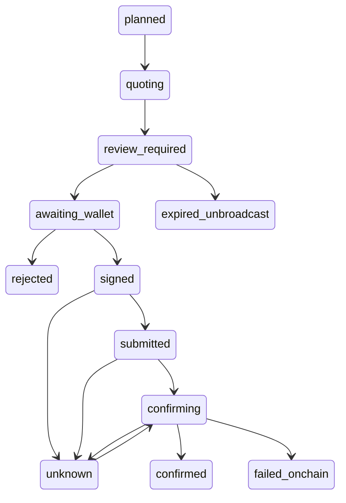

# Lotline continuation — September 19, 2026

This pass began on clean `main` at `b843014` in the existing Lotline repository. It fixes previously untested execution/recovery defects and completes the manual reminder workflow. **It does not establish a working mainnet purchase.** The prior completion wording was too broad: transaction-envelope checks were present, but an enforceable swap-instruction validator was not.

## Preservation and implemented changes

The L1/L4/L5/L6 design, three-branch mark, green cards/footer, continuous visible decorative motion, reduced-motion/offscreen behavior, exact allocation math, 832-identity Example catalog, official logos, authentication, public-only PWA cache, brand kit and original films are preserved.

| Surface | Change and purpose |
| --- | --- |
| Wallet review | Correct Wallet Standard variadic signing contract, v0 capability check, account-change/disconnect invalidation, exact decimal USDC labels and recoverable order fees. |
| Restored runs | Normalize actual database response fields; retain the saved run ID and completed legs; a lost submit response blocks another signature until reconciliation. |
| Provider submission | Persist the original signature and signed-byte hash before submitting; a provider failure remains unknown rather than becoming safely retryable. |
| Receipt checks | Verify original signed bytes/message/signature/blockhash, mainnet genesis, matching confirmed/finalized slot, transaction error, wallet-owned token deltas, exact USDC debit, minimum token output and SOL cost cap. Missing proof remains unknown. Downloaded JSON contains historical raw receipt amounts and reviewed intent, excluding transaction bytes and access capabilities. |
| Paused purchases | Owner-scoped saved-run reads and original-signature reconciliation remain separately available when configured, even while new purchases are disabled. |
| Journal | Canonical intent hashing, immutable original transaction/signature, preserved review evidence, recovery of partially created runs and owner-scoped schedule-occurrence reuse. |
| SQL integrity | One active attempt across a run, atomic attempt/leg/run/event projection, unsigned expiry, bounded retention preserving unresolved/fresh receipts, occurrence uniqueness and schedule validation/versioning. |
| Manual reminders | Save exact budget/split, cadence, IANA timezone and due date; restore that snapshot; pause/resume, calendar export, next-future-date action, stable occurrence identity and explicit cloud create/update/load. A lost creation response can be retried within the same owner; late cloud responses cannot overwrite newer device edits. |
| Demo and copy | Date the original September 12 films, disclose their planner scope, describe the prefilled official Jupiter handoff and correct stale release/readiness claims. |

## Provider and route boundaries

| Integration | Evidence and limitation |
| --- | --- |
| Official xStocks identity | Fresh production catalog returns 832 reviewed identities. Catalog membership does not guarantee a trade route or eligibility. |
| Solana mainnet | Opt-in read-only smoke passed issuer/mint/scaling, public holdings and projected units. No wallet signature or submission. |
| Jupiter `/swap/v2/order` without taker | Fresh amount-specific keyless quote passed. |
| Jupiter executable order/execute | Strict envelope/signed-message checks and fixture coverage; disabled. Current encoded swap instruction proof and representative orders remain required. |
| Wallet Standard | Fake-wallet browser coverage; no real user wallet was connected or prompted. |
| Supabase | Read-only remote migration/grant checks: first four migrations applied; execution tables inaccessible to anon/authenticated roles. Pending SQL tested locally in PostgreSQL/WASM. |
| SMTP | Signup/recovery remain gated; no new sender/domain or delivery proof was supplied. Existing historical account evidence is not an email-delivery test. |
| Tokens.xyz | Optional enrichment disabled without approved credentials; no effect on core planning. |

The [current Jupiter order/execute documentation](https://developers.jup.ag/docs/swap/order-and-execute) and [official instruction-parser IDL](https://github.com/jup-ag/instruction-parser/blob/main/src/idl/jupiter.ts) were checked. The legacy IDL alone does not prove the current Token-2022 remaining-account/CPI contract or every encoded spend/minimum-output bound. An environment flag cannot replace that missing implementation. Other routers and lookup-table layouts remain unsupported.

Private route contracts remain same-origin and `no-store`:

- `GET /api/execution/config`: HTTP 200 capability document; `enabled: false` describes unavailable purchases.
- `POST /api/execution/runs`: validated immutable intent; owner/capability scoped and occurrence-aware.
- `GET /api/execution/runs/:runId`: original-owner snapshot with private capability fields and unsigned transaction bytes removed.
- `POST /api/execution/runs/:runId/legs/:legId/order`: gated just-in-time reviewed order; no action when instruction safety is incomplete.
- `POST …/execute`: binds exact reviewed bytes, persists signature before provider call, never treats provider failure as proof of non-broadcast.
- Both `POST …/reconcile` variants: original owned signature only, exact chain evidence, no replacement order.
- `GET/POST/PATCH /api/contribution-schedules`: authenticated owner metadata; local guest reminders remain available.



The real state names use hyphens; underscores above are diagram identifiers. Unknown settlement never returns to planned. Completed legs are not repurchased. A due reminder prepares a human review, not an automatic transaction.

An identical unscheduled intent reopens its existing run, including a completed run. To prepare a repeat contribution with the same split, advance the saved reminder to its next review; its new occurrence distinguishes the new contribution. This is deliberate duplicate protection, not automatic repeat purchasing. Recovery remembers the last run within its browser tab; an account-wide historical run picker is not included.

## Database and rollback

Remote Supabase project: `uemunksopacicpbjubtg`. Fresh read-only migration listing still shows only the first four migrations. Pending:

1. `20260915090000_guest_execution_owner_index.sql`
2. `20260919090000_execution_integrity.sql`

No remote SQL mutation was performed. Apply in timestamp order only as part of an authorized release after review. Keep `LOTLINE_EXECUTION_ENABLED=false`, `LOTLINE_EXECUTION_VALIDATOR_READY=false`, and both guest/integrity migration readiness flags false until verified. Even all true flags cannot override the current implementation gate.

Before a future application rollback, disable creation/submission first and retain journal reads/reconciliation. Preserve both additive migrations and all receipt rows; do not restore the old guest-coalescing index or delete unknown attempts. In particular, do not roll back to code that writes leg/run summaries separately after the atomic trigger is installed. A DB rollback requires a forward compatibility migration and review of existing rows, not destructive table removal.

PGlite tests run all six actual SQL migrations against an isolated in-memory database with mocked Supabase auth roles. They prove syntax, role restrictions, quotas, state constraints, retention and projection behavior. This single-connection harness does not prove hosted multi-session race timing or operational load. [Runtime documentation](https://pglite.dev/docs/).

## Local, production and external status

Production remains the already-existing READY deployment `dpl_88ZK9kq83Gh717dqpYqAx5ehtFB6`, created September 17 at 17:22:49 UTC. It serves [lotlineonsolana.vercel.app](https://lotlineonsolana.vercel.app). This pass's local changes are not deployed or pushed. [Fresh production observation](releases/2026-09-19/production-observation.json) records HTTP routes, catalog and disabled execution separately from local fixture checks.

Local `.env.local` contains Supabase public configuration, a server secret and RPC configuration; values were withheld. Jupiter and Tokens keys and execution readiness flags were absent locally. Production's public capability response still reports a missing Jupiter key, unconfirmed guest migration, paused flag and validator review. Secret values were not read into logs or copied into evidence.

No signup/recovery email was sent; no account, paid service, production setting or migration was changed; no trade was signed or submitted; no competition submission was made. Actual team names/contact and final reviewed release reference remain owner-supplied submission fields.

## Work still required for an in-app purchase

1. Obtain representative current Jupiter executable orders and a verified instruction/account contract for the exact supported Token-2022 route. Implement and test decoding of its enforceable spend/minimum-output bounds, token-account semantics and RPC simulation. The current code intentionally cannot enable signing without this implementation; merely setting a readiness variable is insufficient.
2. Establish the issuer/distributor access policy for the intended users and supported assets. Technical mint validity does not establish purchase eligibility.
3. In a separately authorized release, apply the two pending migrations, verify hosted concurrency/history behavior and configure server-side Jupiter credentials and readiness flags. Keep signing disabled through those checks.
4. Obtain a separately authorized wallet and amount for any actual settlement test, then verify the original transaction and receipt. This pass did not perform a funded smoke.

SMTP delivery and optional Tokens.xyz context are separate configuration items. They do not prevent guest contribution planning, local reminders or the official Jupiter handoff.

## Verification evidence

- Lint and TypeScript passed. The unit suite passed **333 tests**, with its opt-in external smoke skipped. The later owner-scoped reminder retry tests passed **3/3**, for **336 passing deterministic tests** in this pass.
- The final [production build](releases/2026-09-19/build.log) passed after the final receipt function change. The earlier [unit checkpoint log](releases/2026-09-19/unit-checkpoint.log) includes the first build, which was intentionally stopped for that source change; it is not the final build result.
- General code review and the TypeScript/security-focused review report no remaining actionable findings. This approves the reviewed changes, not real trading readiness.
- Fresh [existing-production captures](releases/2026-09-19/production-before/observations.json) cover home and Example at 1440/390px. Matching [local production-build captures](releases/2026-09-19/local-after/observations.json) add sign-in and 320px. All 13 captures report zero horizontal overflow. These are separate builds, not a claim of deployment.
- Original design-media verification decoded all nine optimized derivatives successfully; the 20-entry brand manifest and both September 12 film packages retain matching hashes and sizes.
- The [built-client secret scan](releases/2026-09-19/client-secret-scan.json) found no configured privileged key values in 27 static files. It checked the one locally configured privileged value; absent service keys were not invented or disclosed.

The **11 controlled browser scenarios** passed across a full run (10 passing, one cadence-locator timeout) and the corrected-selector rerun. A separate recorded four-leg run also passed. These exercise signing arguments, rejection, expiry, stale plans, disconnect, duplicate tabs, lost responses, partial recovery, failed-on-chain results, reconciliation while signing is paused, reminder snapshots and slow cloud acknowledgements. The selector correction did not change application code or weaken its assertions.

The [25.2-second MP4 walkthrough](releases/2026-09-19/fixture-walkthrough/execution-fixture-walkthrough.mp4) is silent H.264 at 1440×1000 with a visible fixture-only banner. Its original WebM, six screenshots and [hash/viewport metadata](releases/2026-09-19/fixture-walkthrough/metadata.json) are preserved. Full MP4 decoding passed. This is current local UI evidence with mocked wallet/provider responses, not a mainnet purchase or deployed demonstration.

The fresh [read-only live observation](releases/2026-09-19/live-read-smoke.json) passed at **09:25:54–09:26:11 UTC on September 19**: 832 catalog identities, mint-aware holdings/scaling, a keyless amount-specific Jupiter quote without a taker, and projected unit conversion. It signed and submitted **zero transactions**. The public address in that evidence is an issuer mint authority, not the user's wallet. Its values are dated observations, not ongoing quote guarantees.

The remaining [69 existing browser regressions](releases/2026-09-19/browser-regression.log) passed against the same production build in 8.2 minutes. Together with the 11 controlled scenarios, **80 distinct browser scenarios pass**. Coverage includes ten-asset precision/export/persistence, full catalog search, auth/account isolation, brand downloads, original film playback/captions, selected motion and layouts, keyboard/accessibility, install guidance, private-cache exclusion, offline Example and provider failure states.

Reproduction commands (Node **22.19.0**, npm lockfile):

```sh
npm run lint
npm run typecheck
npm test
npm exec vitest -- run tests/contribution-schedule-route.test.ts
npm run build
# Start the production build, then use its origin for the browser suite.
E2E_BASE_URL=http://127.0.0.1:3113 npm exec playwright -- test
LOTLINE_RECORD_EXECUTION=1 E2E_BASE_URL=http://127.0.0.1:3113 npm exec playwright -- test tests/e2e/execution-journey.spec.ts -g 'four legs stop'
# Explicit read-only external check; no taker, wallet signing or execute request.
SOLANA_RPC_URL=https://api.mainnet-beta.solana.com LOTLINE_LIVE_SMOKE=1 npm exec vitest -- run tests/server-live.test.ts
```

In this pass the unchanged existing suite and new execution suite ran separately to preserve their evidence directories. The final selector-only adjustment also passed targeted lint and code review. No application source changed after the successful final build.

The exact changed-file list, file hashes and baseline are in the [delivery manifest](releases/2026-09-19/delivery-manifest.json). [Short and full descriptions](product-description.md), the [submission draft](stocklana-submission.md), [video scope/source notes](video-release.md) and [demo presentation script](execution-demo-script.md) are ready for review. The local preview is running at `http://127.0.0.1:3113`; it is separate from the unchanged public deployment.
